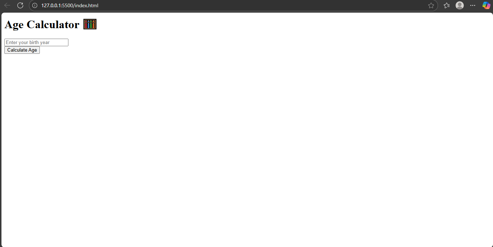

# 🧮 Age Calculator App

A simple, beginner-friendly Age Calculator built using **HTML**, **CSS**, and **JavaScript**.  
This app calculates your age based on the birth year you enter.

---

## 📸 Screenshot

---

## 🚀 How to Use

1. Enter your birth year in the input field (e.g., 2000)
2. Click on the "Calculate Age" button
3. Your current age will be displayed instantly

---

## 💡 Features

- Instant age calculation
- Clean and responsive UI
- Error message for empty input
- Mobile-friendly layout (if styled)

---

## 🛠️ Technologies Used

- HTML
- CSS
- JavaScript

---

## 📂 Project Folder Structure

